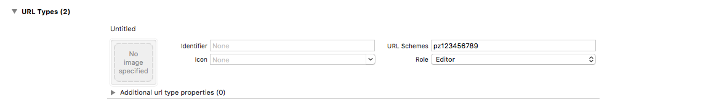
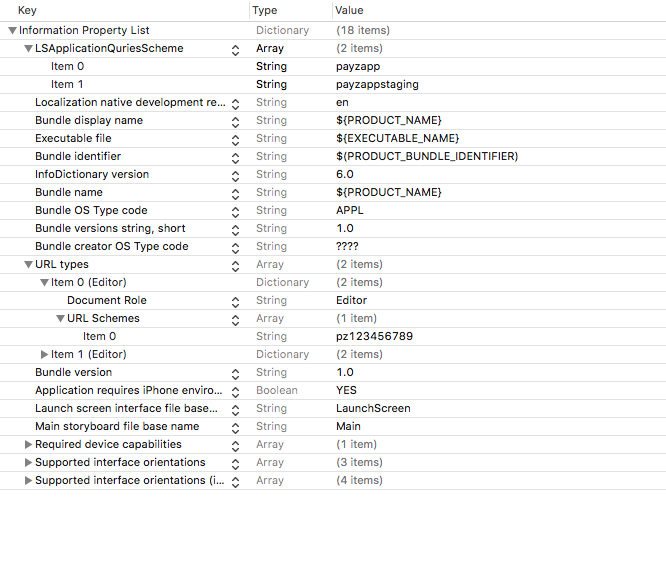

# Wibmo SDK Integration (iOS)
This document describes the steps to integrate the Wibmo SDK with your iOS application, to make IAP (In App Payments) using PayZapp platform. 

### Important 
You must have a PayZapp Wallet merchant account to use the In-app Payment service.

### System Requirements
To be able to integrate PayZapp into your iOS App you will need the following
* Access to WibmoSdk
* **Merchant ID**, **Merchant App ID** and **Hash Key** from PayZapp UAT/production environment.
* This documentation and sample App.

### Adding Wibmo SDK as dependency to iOS Application
#### Manually (Deprecated)
* Add libWibmoSDK.a to your app. 
* Add include folder to your app. 
#### Cocoa pod (Recommended)
* In your project's podfile include under your app target pod 'wibmo-sdk’.
* Then pod install.

#### Then
1. Add URL scheme to your projects Info.plist file.

* Format for URLScheme: pz<Merchant ID>
* Eg: If your Merchant ID is 123456789 then URLScheme is pz123456789
* 

**Note:**
Merchant ID’s are different for different configuration environments. i.e. Its different for production and UAT environments.

2. In your target's Info.plist add
Add dictionary item LSApplicationQueriesSchemes


### Usage 
1. \#import “WibmoSDK.h" in your ViewController.
2. Include in your AppDelegate methods, and post appropriate notification.

```objc
- (BOOL)application:(UIApplication *)iApplication openURL:(NSURL *)iURL sourceApplication:(NSString *)iSourceApplication
         annotation:(id)iAnnotation {
    if (iURL && [[iURL scheme] isEqualToString:@"pz81516121"]) {
        [[NSNotificationCenter defaultCenter] postNotificationName:PROCESS_INAPP_PAYMENT object:[iURL absoluteString]];
    }
    return YES;
}

- (BOOL)application:(UIApplication *)application handleOpenURL:(NSURL *)iURL {
    if (iURL && [[iURL scheme] isEqualToString:@"pz123456789"]) {
        [[NSNotificationCenter defaultCenter] postNotificationName:PROCESS_INAPP_PAYMENT object:[iURL absoluteString]];
    }
    return YES;
}
```

**Note:** 
For application supporting only iOS 9 and above please use the below method. 

```objc
- (BOOL)application:(UIApplication *)app openURL:(NSURL *)url options:(NSDictionary<UIApplicationOpenURLOptionsKey,id> *)options {
    if (iURL && [[iURL scheme] isEqualToString:@"pz123456789"]) {
        [[NSNotificationCenter defaultCenter] postNotificationName:PROCESS_INAPP_PAYMENT object:[iURL absoluteString]];
    }
    return YES;
}
```

3. To initiate payment do :- 
	1. Initialise WSMerchantInfo, WSTransactionInfo, WSCustomerInfo, WSUrlInfo
	2. Initialise WibmoSDK  and make payment. Eg:- 


```objc
WibmoSDK *aWibmoSDK = [[WibmoSDK alloc] initWithTransactionInfo:aTransactionInfo merchanInfo:aMerchantInfo customerInfo:aCustomerInfo withDelegate:self];
    [self.navigationController presentViewController:aWibmoSDK animated:YES completion:^{
        if (self.isWPayEnabled) {
            aTransactionInfo.supportedPaymentType = @[PAYMENT_TYPE_ALL];
            aTransactionInfo.restrictedPaymentType = @[PAYMENT_TYPE_ALL];
            [aWibmoSDK initializePayment];
        } else {
            aTransactionInfo.supportedPaymentType = @[PAYMENT_TYPE_ALL];
            aTransactionInfo.restrictedPaymentType = @[PAYMENT_TYPE_ALL];
            [aWibmoSDK initializeW2FAPayment];
        }
    }];	
```

**Note:** 
WibmoSDK can point to different url based on your environment. i.e. production or staging.
	3. Implement WibmoSDK protocols (listed below) as per your requirement.
```objc
- (void)paymentSuccessfulWithTranscation:(NSDictionary *)iTransaction;
- (void)paymentFailedWithError:(NSError *)iError;
- (void)paymentCancelled;
- (void)paymentTimedOut;	  
```

Eg:
```objc
- (void)paymentSuccessfulWithTranscation:(NSDictionary *)iTransaction {
    NSString *aTransactionID = [iTransaction valueForKey:@"wibmoTxnId"];
    self.aPaymentDetails = iTransaction;
    [self.navigationController dismissViewControllerAnimated:YES completion:^{
        NSString *aMessage = [NSString stringWithFormat:@"Your payment was made successfully.\n\nTransaction ID: %@", aTransactionID];
        if ([aTransactionID isKindOfClass:[NSNull class]]) {
            aMessage = [NSString stringWithFormat:@"Your payment was made successfully."];
        }
        if ([iTransaction valueForKey:@"dataPickUpCode"]) {
            aMessage = [aMessage stringByAppendingFormat:@"\n\nPickUp Code: %@", [iTransaction valueForKey:@"dataPickUpCode"]];
        }
        
        [[[UIAlertView alloc] initWithTitle:@"Congratulations!" message:aMessage delegate:self cancelButtonTitle:@"Ok" otherButtonTitles:nil] show];
    }];
}

- (void)paymentFailedWithError:(NSError *)iError {
    [self.navigationController dismissViewControllerAnimated:NO completion:^{
        self.merchantTransactionID = nil;
        NSDictionary *errorDic = iError.userInfo;
        //Handle Error 
    }];
}

- (void)paymentCancelled {
    [self.navigationController dismissViewControllerAnimated:YES completion:^{
        self.merchantTransactionID = nil;
        NSString *aMessage = [NSString stringWithFormat:@"Your payment was cancelled."];
        [[[UIAlertView alloc] initWithTitle:@"Failed!" message:aMessage delegate:self cancelButtonTitle:@"Ok" otherButtonTitles:nil] show];
    }];
}

- (void)paymentTimedOut {
    [self.navigationController dismissViewControllerAnimated:YES completion:^{
        self.merchantTransactionID = nil;
        NSString *aMessage = [NSString stringWithFormat:@"Your payment was timed out."];
        [[[UIAlertView alloc] initWithTitle:@"Sorry!" message:aMessage delegate:self cancelButtonTitle:@"Ok" otherButtonTitles:nil] show];
    }];
}
```

**Note:**
Error Response Dictionary Eg: 

```javascript
{
"resCode": "000",
"resDesc": "SUCCESS",
"status": "50020",
"pgErrorCode": "0",
"pgErrorDetail": "No Error",
"pgVoidTransactionId": "50204001", "newMerchantReferenceNo": "WPAYTXN1125398084375506", "rrn": "636510123204"
}

{
"resCode": "050",
"resDesc": "FAILURE",
"status": "50021",
"pgErrorCode": "10024",
"pgErrorDetail": "Void has already been done"
}

{
"resCode": "053",
"resDesc": "Invalid client IP in void request!"
}
```

**Important:** 
_Error Codes and Description_ 


| Code  | Description | 
| ----- | ----------- |
| 053   | Merchant Txn Id/WibmotxnId not passed! |
| 053   | Bad merchantId |
| 053   | Merchant not active! |
| 053   | Invalid client IP in void request! |
| 051   | Internal Error | 
| 204   | User Abort |
| 070   | Message hash failed |
| 080   | Too Early; Re-try after some time |
| 000   | Success |
| 050   | Failure |

_Status Code and Description_ 

| Code  | Description | 
| ----- | ----------- |
| 50020 | Success|
| 50021 | Failed |

**Note:**
* You can download the Example App at the github repository [here](https://github.com/wibmo/wibmo-iap-sdk-ios/tree/master/TestPayZapp)
* Especially note in the example app that if amount and message hash amount are different then you should get a message hash failure as the response from the sdk.

   
